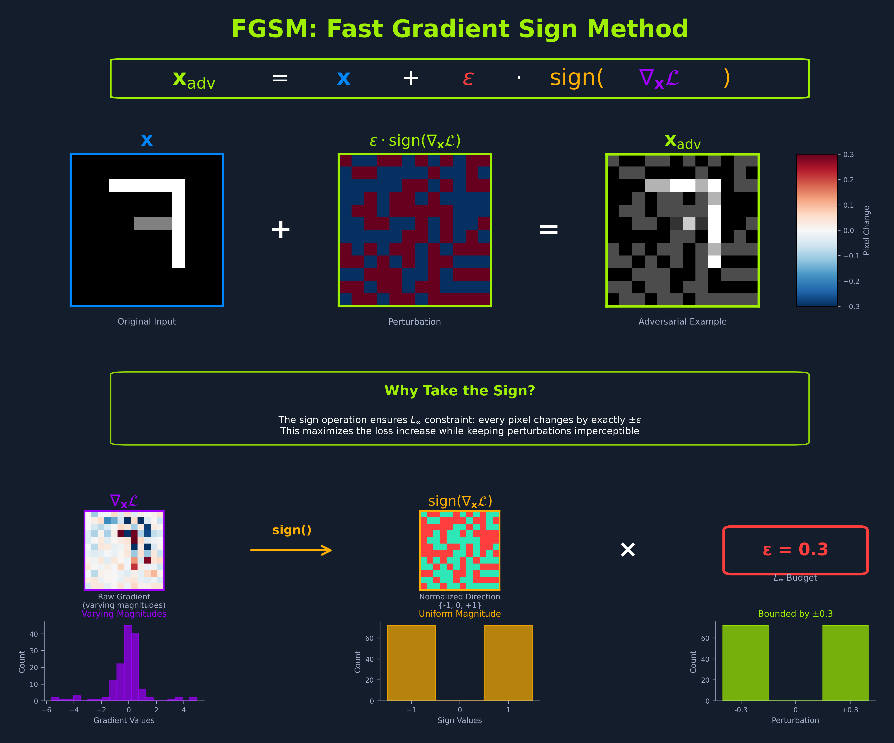

# FGSM
The **Fast Gradient Sign Method (FGSM)** arrived as a bit of a wake-up call for the deep learning field.

The gradient is a map of sensitivities: it indicates which way to nudge each pixel to make the loss increase the fastest. 

The sign operation extracts only the direction of that nudge for each pixel and discards how large the change would be, so the algorithm changes every pixel by the same small amount ϵ but in the direction that increases the loss. The L∞ budget limits the maximum absolute change to any single pixel, not the average change across all pixels. (See the Introduction’s Understanding Norms section for the explanations of L∞, L2, L1, and their geometric interpretations if you need a reminder.)

## Core Implementation

### Computing loss without side effects

# I-FGSM
The Iterative Fast Gradient Sign Method (I-FGSM), also known as the Basic Iterative Method (BIM), was introduced by Kurakin et al. in Adversarial Examples in the Physical World (2016) "linked below" as an extension of Goodfellow et al.’s original FGSM method. Instead of one large, well-aimed step, the algorithm takes several small, well-aimed steps. Each step follows the input gradient’s sign, then projects back to the allowed L∞ budget around the original image. The result is a refined adversarial that more reliably crosses decision boundaries with the same overall budget.