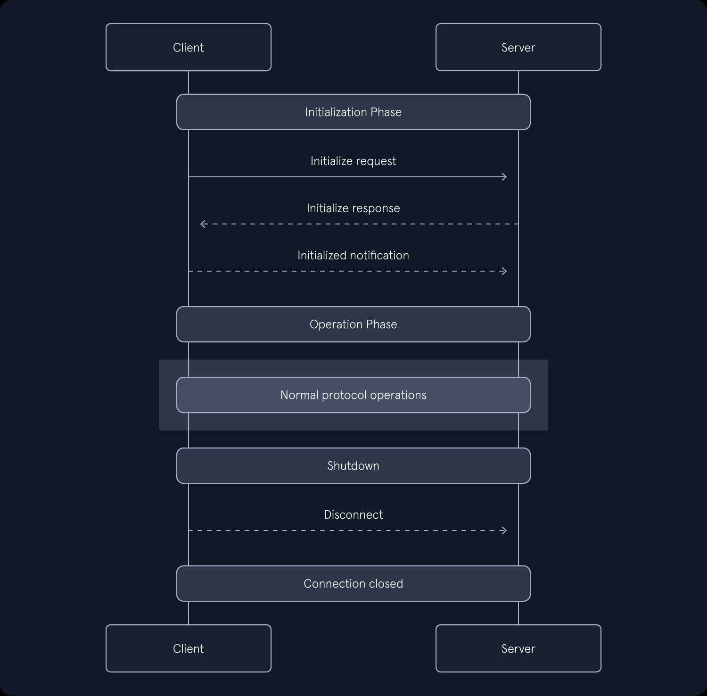

**The Model Context Protocol (MCP)** aims to standardize the connection between AI applications, particularly LLM applications, and external tools and data providers. Before MCP, each integration into the LLM application was realized through a custom API provided by the integration provider. 

## MCP Overview

The MCP architecture consists of three core components:

- Hosts: The host acts as a container and coordinator for client instances. It manages them and coordinates the LLM integration. A host can create multiple client instances.
- Client: The host creates an MCP client, which connects to an MCP server and handles MCP communication with the server. A client can only connect to a single server.
- Server: An MCP server can provide capabilities either locally or remotely.

The MCP server provides the core MCP functionality as capabilities. Three primary capabilities are supported:

- Prompts: The user can select a prompt template from the server. Prompts may accept parameters for customization.
- Resources: The application can select to enrich the user's query with context from a resource. Resources are identified by URIs and may accept parameters for customization.
- Tools: The model can select to invoke a tool based on the contextual understanding of the user's query. Tools expose actions to the LLM and provide functionality similar to function calling.

## MCP Communication

- **Request**: A request message initiates an operation. It contains the members id, which is a unique request ID, and method, which specifies the type of operation to initiate. It may further contain the member params, which consists of the respective parameters.
- **Response**: A response message results from a previous request. It contains the same id member as the corresponding request. Furthermore, it contains either a result member or an error member, depending on the result of the respective operation.
- **Notification**: A notification message is a one-way message, i.e., there is no response. It does not contain an id member but only a method member and, if necessary, a params member.

MCP defines two different transport mechanisms to transmit the messages between client and server:

- **stdio**: This transport mechanism uses the client and server processes' standard in and standard out provided by the operating system. It can only be used if the client and server run on the same local system.
- **Streamable HTTP**: The MCP server starts an HTTP server. The client communicates with the server via HTTP GET and POST requests, while the server may use Server-Sent Events (SSE) to communicate with the client. Server-Sent Events enable servers to push data to clients without previous client requests. This enables MCP servers to send request messages to the client without waiting for the client to make an HTTP request to the MCP server (polling).

##  MCP Protocol Flow

### Initialization
The first part of the connection consiting of 3 messages. 

#### 1. Initialization request
Contains:
- Method member is set to initializa
- params member contains:
    - latest MCP protocol version in the *protocolVersion* key
    - capabilities supported by the client in the *capabilities* key
    - general client info (name, version, etc.) in the *clientInfo* key

#### 2. Initialization response
Contains:
- The latest MCP protocol version supported by the server in the *protocolVersion* key
- The capabilities supported by the server in the *capabilities* key
- General server information, such as server name and server version, in the *serverInfo* key

#### 3. Initialized Notification
Contains only the method number. 

### Operation
The operation phase is the central part of MCP where the client and server exchange messages. This phase typically consists of requests and responses based on the information exchanged during initialization.

method member info:
- **prompts/lis**t: Retrieve a list of available prompts.
- **prompts/get**: Retrieve a specific prompt. The target prompt and potentially additional arguments are supplied in the params member.
-** resources/list**: Retrieve a list of available resources.
- **resources/templates/list**: Retrieve a list of available resource templates.
- **resources/read**: Retrieve resource contents. Both the URI and, in case of resource templates, additional parameters are supplied in the params member.
- **tools/list**: Retrieve a list of available tools.
- **tools/call**: Invoke a specific tool. The target tool and potentially additional arguments are supplied in the params member.

### Shutdown

The shutdown may be initiated by either the client or the server. On the MCP level, no specific shutdown message is defined. In practice, the MCP session is terminated by terminating the underlying transport connection. More specifically, if the stdio transport mechanism is used, the input or output stream is closed. The HTTP connection is closed if the Streamable HTTP transport mechanism is used. After closing the transport mechanism, the MCP session is terminated.s